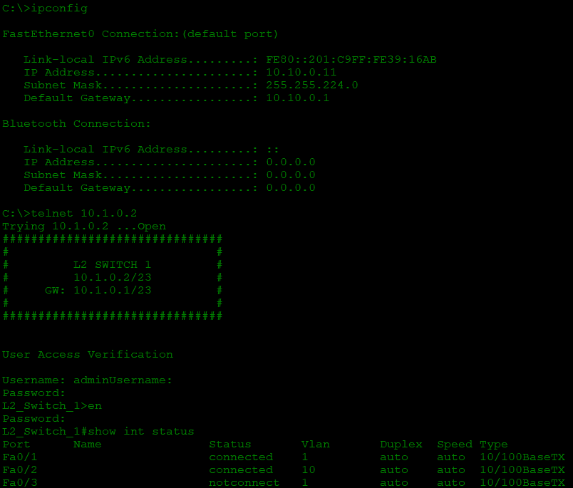
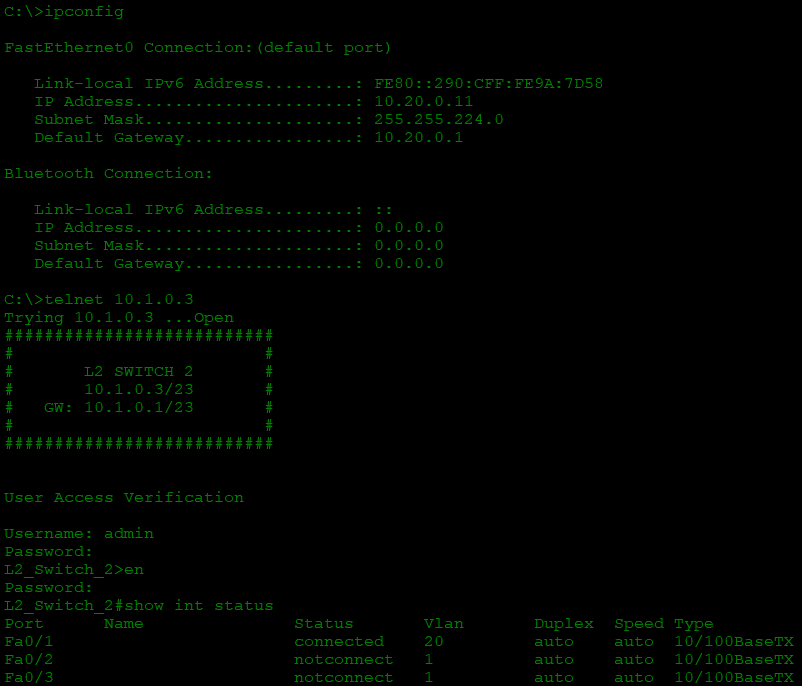

# Telnetable-L2-Switch-IP-address
A simple lab setup demonstrating how to configure and assign an IP address to a Layer 2 switch, making it reachable via Telnet.

**It includes:**
   1. Basic configuration
   2. VLAN Configuration
   3. IP Routing
   4. Assigning IP addresses to Switches
   5. Diagrams, config files, and test results

## 📷 Network Diagram

## 🧰 Components Used

- **Managed Switches** (Cisco Catalyst 3560 & Cisco Catalyst 2960X-Series)
- Multiple internal VLANs
- Application: MobaXTerm, Cisco Packet Tracer 7.3.0.0838 & Eve-NG for configurations and testing

---

## 🛠️ Configuration Overview

### 🖧 CISCO CATALYST 3560:
<pre>
#Basic configuration

conf t
hostname L3_Switch
service password-encryption
enable secret pass
username admin secret pass
line con 0
login
password pass
exec-timeout 5 0
logging sync
exit
line vty 0 4
login local
exec-timeout 5 0
transport input all
logging sync
exit
banner login @
#########################
#                       #
#   MULTILAYER SWITCH   #
#      10.1.0.1/23      #
#                       #
#########################@
exit
write mem

#Creating VLAN

conf t
int vlan 1
  ip 10.1.0.1 255.255.254.0
  no shut
  exit
vlan 10
  name vlan10-net
  exit
vlan 20
  name vlan20-net
  exit
int vlan 10
  ip add 10.10.0.1 255.255.224.0
  no shut
  exit
int vlan 20
  ip add 10.20.0.1 255.255.224.0
  no shut
  exit
exit
wr

#Creating DHCP Pool for VLAN 10 & 20 and exclusion

conf t
ip dhcp pool vlan10-pool
  network 10.10.0.0 255.255.224.0
  default-router 10.10.0.1
  exit
ip dhcp pool vlan20-pool
  network 10.20.0.0 255.255.224.0
  default-router 10.20.0.1
  exit
ip dhcp excluded-address 10.10.0.1 10.10.0.10
ip dhcp excluded-address 10.20.0.1 10.20.0.10
exit
wr

#Enabling IP routing function

conf t
ip routing
exit
wr
</pre>

### 🖧 CISCO CATALYST 2960X-1:
<pre>
#Basic configuration

conf t
hostname L2_Switch_1
service password-encryption
enable secret pass
username admin secret pass
line con 0
login
password pass
exec-timeout 5 0
logging sync
exit
line vty 0 4
login local
exec-timeout 5 0
logging sync
transport input all
exit
banner motd @
##############################
#                            #
#        L2 SWITCH 1         #
#        10.1.0.2/23         #
#    GW: 10.1.0.1/23         #
#                            #
##############################@
exit
wr

#Configuring VLAN 1 and default gateway

conf t
ip default-gateway 10.1.0.1

int vlan 1
ip add 10.1.0.2 255.255.254.0
no shut
exit
exit
wr
</pre>

### 🖧 CISCO CATALYST 2960X-2:
<pre>
#Basic configuration

conf t
hostname L2_Switch_2
service password-encryption
enable secret pass
username admin secret pass
line con 0
login
password pass
exec-timeout 5 0
logging sync
exit
line vty 0 4
login local
exec-timeout 5 0
logging sync
transport input all
exit
banner motd @
#############################
#                           #
#        L2 SWITCH 2        #
#        10.1.0.3/23        #
#    GW: 10.1.0.1/23        #
#                           #
#############################@
exit
wr

#Configuring VLAN 1 and default gateway

conf t
ip default-gateway 10.1.0.1

int vlan 1
ip add 10.1.0.3 255.255.254.0
no shut
exit
exit
wr
</pre>

### 🖧 CISCO CATALYST 3560:
<pre>
#Trunking

show int status !check interfaces status (connected, not connected, speed & duplex)
conf t
int giga0/0
switchport mode trunk
  Error: Command rejected: An interface whose trunk encapsulation is "Auto" can not be configured to "trunk" mode.
  !this error shows due to trunking mismatch, 3560 supports ISL (Inter-Switch Link) & 802.1Q while 2960 only support 802.1Q, so we need to manually configure 3560 to 802.1Q
switchport trunk encapsulation dot1q
switchport trunk
exit
int giga0/1
!same with this one
switchport trunk encapsulation dot1q
switchport mode trunk
exit
exit
wr
</pre>

### 🖧 CISCO CATALYST 2960X-1:
<pre>
#Mode Trunk and Mode Access

show int status
conf t
int giga0/0
switchport mode trunk
exit
int f0/0
switchport mode access
switchport access vlan 10
exit
exit
wr
</pre>

### 🖧 CISCO CATALYST 2960X-2:
<pre>
#Mode Trunk and Mode Access

show int status
conf t
int giga0/0
switchport mode trunk
exit
int f0/0
switchport mode access
switchport access vlan 20
exit
exit
wr
</pre>

## 🧪 Testing

#Obtain IP addresses on Computer 1 & 2

---

